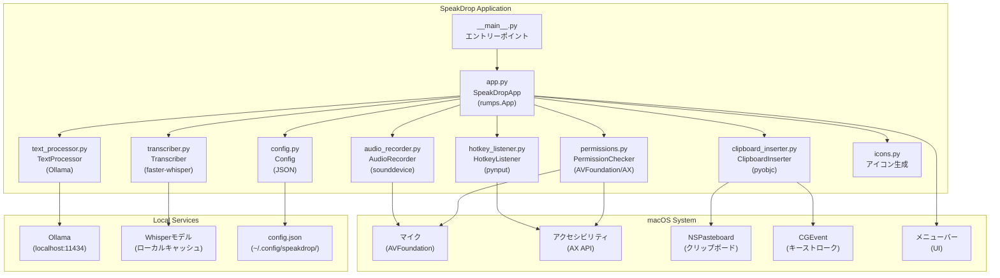

# 技術設計書: SpeakDrop

> このドキュメントはAIエージェント（Claude Code等）が実装を行うことを前提としています。
> 各セクションで「明示された情報」と「不明/要確認の情報」を明確に区別しています。

---

## 情報の明確性チェック

### ユーザーから明示された情報

- [x] 技術スタック: Python 3.11+、rumps、pynput、sounddevice、faster-whisper、Ollama、pyobjc
- [x] アーキテクチャパターン: モジュール分割型ローカルアプリ（メニューバー常駐）
- [x] フレームワーク: rumps（メニューバーUI）、pynput（ホットキー）
- [x] データベース: なし（設定はJSONファイルで永続化）
- [x] 外部サービス連携: Ollama（ローカルLLM、localhost限定）
- [x] セキュリティ要件: 全処理をローカルのみで完結、音声データの非永続化（NFR-005, NFR-006）
- [x] パフォーマンス要件: 10秒音声で5秒以内認識、200文字で3秒以内後処理、待機時500MB以下（NFR-001〜NFR-003）
- [x] コンポーネント構成: 9モジュール（app.py, audio_recorder.py, transcriber.py, text_processor.py, clipboard_inserter.py, hotkey_listener.py, config.py, permissions.py, icons.py）
- [x] 状態管理: AppState enum（IDLE/RECORDING/PROCESSING）
- [x] テスト戦略: pytest + pytest-mock、カバレッジ80%以上
- [x] パッケージ管理: uv
- [x] コード品質: ruff + mypy

### 不明/要確認の情報

| 項目 | 現状の理解 | 確認状況 |
|------|-----------|----------|
| 設定ダイアログの実装方法 | rumpsのwindow()またはrumps.Windowを使用すると推測 | [x] 要件で「設定ダイアログを表示」と明示されているが実装方法は未指定。設計ではrumps.Windowを採用 |
| モデルダウンロード進捗の通知手段 | macOS通知（NSUserNotification or UserNotifications）を使用すると推測 | [x] REQ-020で「通知で表示」と明示。rumpsのnotification()を採用 |
| アイコン画像形式 | PNGまたはテンプレート画像を動的生成すると推測 | [x] icons.pyで動的生成する方針（ユーザー指示で明示） |

---

## アーキテクチャ概要

SpeakDropはmacOSのメニューバーに常駐する音声入力アプリケーションです。プッシュトーク方式（ホットキー押下中のみ録音）により、任意のアプリケーションに音声でテキストを入力できます。すべての処理（音声認識・テキスト後処理）はローカル環境内で完結します。

### アーキテクチャ図



### データフロー

```
キー押下 → HotkeyListener → AudioRecorder.start_recording()
                          → SpeakDropApp: 状態 IDLE → RECORDING
                          → メニューバーアイコン: 録音中

キー離し → HotkeyListener → AudioRecorder.stop_recording() → audio: np.ndarray
                          → SpeakDropApp: 状態 RECORDING → PROCESSING
                          → メニューバーアイコン: 処理中
                          → Transcriber.transcribe(audio) → text: str
                          → TextProcessor.process(text) → processed_text: str
                          → ClipboardInserter.insert(processed_text)
                          → SpeakDropApp: 状態 PROCESSING → IDLE
                          → メニューバーアイコン: 待機中
```

---

## プロジェクト構成

```
SpeakDrop/
├── pyproject.toml              # プロジェクト設定・依存関係（uv管理）
├── README.md                   # プロジェクト説明
├── speakdrop/
│   ├── __main__.py             # エントリーポイント
│   ├── app.py                  # メインアプリケーション（rumps.App）
│   ├── audio_recorder.py       # 音声録音モジュール（sounddevice）
│   ├── transcriber.py          # 音声認識モジュール（faster-whisper）
│   ├── text_processor.py       # テキスト後処理モジュール（Ollama）
│   ├── clipboard_inserter.py   # クリップボード・テキスト挿入モジュール（pyobjc）
│   ├── hotkey_listener.py      # グローバルホットキー監視モジュール（pynput）
│   ├── config.py               # 設定管理モジュール（JSON永続化）
│   ├── permissions.py          # macOS権限確認モジュール
│   └── icons.py                # メニューバーアイコン生成
├── tests/
│   ├── __init__.py
│   ├── test_audio_recorder.py
│   ├── test_transcriber.py
│   ├── test_text_processor.py
│   ├── test_clipboard_inserter.py
│   ├── test_hotkey_listener.py
│   └── test_config.py
└── docs/
    └── sdd/
        ├── requirements/       # 要件定義
        └── design/             # 設計書（このファイル）
```

---

## コンポーネント詳細設計

### AppState (enum) - `app.py`

アプリケーションの状態を表す列挙型。状態遷移の整合性を型で保証します。

```python
from enum import Enum, auto

class AppState(Enum):
    IDLE = auto()        # 待機中（ホットキー監視中）
    RECORDING = auto()   # 録音中（ホットキー押下中）
    PROCESSING = auto()  # 処理中（認識・後処理・挿入中）
```

**状態遷移図**:

```
IDLE ──[ホットキー押下]──> RECORDING
RECORDING ──[ホットキー離放]──> PROCESSING
PROCESSING ──[テキスト挿入完了]──> IDLE
PROCESSING ──[エラー発生]──> IDLE
```

---

### SpeakDropApp - `app.py`

**役割**: アプリケーション全体の統合・状態管理・メニューバーUI

**継承**: `rumps.App`

**対応要件**: REQ-003, REQ-004, REQ-010, REQ-011, REQ-012, REQ-013

```python
class SpeakDropApp(rumps.App):
    def __init__(self) -> None:
        super().__init__("SpeakDrop", quit_button=None)
        # 各コンポーネントの初期化
        self.config: Config
        self.audio_recorder: AudioRecorder
        self.transcriber: Transcriber
        self.text_processor: TextProcessor
        self.clipboard_inserter: ClipboardInserter
        self.hotkey_listener: HotkeyListener
        self.state: AppState = AppState.IDLE
```

**メニュー構成**:

| メニュー項目 | 種別 | 動作 |
|------------|------|------|
| 状態表示（例: "待機中"） | 非クリック項目 | 現在のAppStateを表示 |
| 音声入力 ON / OFF | チェックボックス | HotkeyListenerの有効/無効切替 |
| 設定... | クリック項目 | 設定ダイアログを表示 |
| 終了 | クリック項目 | アプリ終了 |

**主要メソッド**:

| メソッド | シグネチャ | 説明 |
|---------|-----------|------|
| `set_state` | `(state: AppState) -> None` | 状態遷移・アイコン更新・メニュー更新（NFR-007: 200ms以内） |
| `on_hotkey_press` | `() -> None` | HotkeyListenerのpressコールバック → 録音開始 |
| `on_hotkey_release` | `() -> None` | HotkeyListenerのreleaseコールバック → 録音停止・処理開始 |
| `process_audio` | `(audio: np.ndarray) -> None` | 認識→後処理→挿入を非同期スレッドで実行 |
| `open_settings` | `(_: rumps.MenuItem) -> None` | 設定ダイアログ表示 |

**初期化シーケンス**:
1. `Config.load()` で設定読み込み（REQ-017）
2. `PermissionChecker` でマイク・アクセシビリティ権限確認（REQ-021, REQ-022）
3. 権限不足の場合は音声入力を無効化して起動
4. `HotkeyListener` を非同期スレッドで起動

---

### AudioRecorder - `audio_recorder.py`

**役割**: マイクからの音声録音（メモリ上のみ）

**対応要件**: REQ-001, REQ-002、NFR-004（16kHz/Mono/16bit）、NFR-006（非永続化）

```python
class AudioRecorder:
    SAMPLE_RATE: int = 16000   # NFR-004: 16kHz
    CHANNELS: int = 1           # NFR-004: モノラル
    DTYPE: str = "int16"        # NFR-004: 16bit PCM

    def start_recording(self) -> None:
        """録音開始。sounddevice.InputStreamを開始する。"""

    def stop_recording(self) -> np.ndarray:
        """録音停止。録音データをnp.ndarrayとして返す。
        認識完了後にデータをメモリから破棄（NFR-006対応）。"""
```

**実装詳細**:
- `sounddevice.InputStream` でコールバック方式の録音
- 録音データは `list[np.ndarray]` に逐次蓄積
- `stop_recording()` で `np.concatenate()` して返却
- 返却後にバッファをクリア（`del self._frames`）

---

### Transcriber - `transcriber.py`

**役割**: faster-whisperによる音声認識

**対応要件**: REQ-002、NFR-001（10秒音声で5秒以内）、REQ-018, REQ-019（モデル選択・再読込）

```python
class Transcriber:
    def __init__(self, model_id: str = "kotoba-tech/kotoba-whisper-v1.0") -> None:
        self._model: WhisperModel | None = None  # 遅延ロード
        self._model_id: str = model_id

    def transcribe(self, audio: np.ndarray) -> str:
        """音声データを認識してテキストを返す。
        初回呼び出し時にモデルをロード（遅延ロード）。"""

    def reload_model(self, model_id: str) -> None:
        """モデルを変更して再読み込み（REQ-019）。
        ダウンロードが必要な場合は進捗を通知（REQ-020）。"""
```

**実装詳細**:
- `faster_whisper.WhisperModel` を使用
- `device="auto"` でApple Silicon MPS / CPU を自動選択
- `compute_type="int8"` でメモリ効率を最適化
- モデルキャッシュ: faster-whisperのデフォルトキャッシュディレクトリ使用
- `language="ja"` を指定して日本語認識に特化
- セグメントを結合して単一文字列として返却

**対応モデル一覧**（REQ-018）:

| モデル識別子 | 表示名 | 目安サイズ | デフォルト |
|------------|--------|----------|-----------|
| `kotoba-tech/kotoba-whisper-v1.0` | large-v3-ja (Kotoba Whisper) | 約4GB | はい |
| `large-v3` | large-v3 | 約4GB | - |
| `medium` | medium | 約2GB | - |
| `small` | small | 約1GB | - |

---

### TextProcessor - `text_processor.py`

**役割**: Ollama LLMによる句読点挿入・話し言葉整形

**対応要件**: REQ-007, REQ-008, REQ-009、NFR-002（200文字で3秒以内）、NFR-005（ローカル処理）

```python
class TextProcessor:
    OLLAMA_HOST: str = "http://localhost:11434"  # NFR-005: ローカルのみ
    MODEL: str = "qwen2.5:7b"

    def process(self, text: str) -> str:
        """テキストを後処理して返す。
        Ollamaが起動していない場合は元のテキストをそのまま返す（REQ-009）。"""
```

**プロンプトテンプレート**:

```python
SYSTEM_PROMPT = """あなたは日本語テキストの校正を行うアシスタントです。
以下のルールに従ってテキストを整形してください：
1. 適切な位置に句読点（。、！？）を挿入する
2. 話し言葉を書き言葉に変換する（例: 〜だけど → 〜ですが）
3. テキストの意味や内容は変更しない
4. 整形後のテキストのみを出力する（説明文は不要）"""
```

**エラーハンドリング**:
- `ollama.ResponseError` または接続エラー → 元テキストをそのまま返す（REQ-009）
- タイムアウト: 5秒（NFR-002の3秒目標に余裕を持たせた値）

---

### ClipboardInserter - `clipboard_inserter.py`

**役割**: クリップボードを介したテキスト挿入

**対応要件**: REQ-005, REQ-006

```python
class ClipboardInserter:
    PASTE_DELAY: float = 0.05  # Cmd+V送信前の待機時間（秒）
    RESTORE_DELAY: float = 0.1  # クリップボード復元前の待機時間（秒）

    def insert(self, text: str) -> None:
        """テキストをアクティブなアプリケーションに挿入する。

        手順:
        1. 既存クリップボード内容を退避（REQ-006）
        2. textをクリップボードにセット
        3. Cmd+Vキーストロークを送信（REQ-005）
        4. 待機（RESTORE_DELAY）
        5. クリップボード内容を復元（REQ-006）
        """
```

**実装詳細**:

| 操作 | 使用API |
|------|---------|
| クリップボード読み取り | `NSPasteboard.generalPasteboard()` |
| クリップボード書き込み | `NSPasteboard.setString_forType_()` |
| Cmd+Vキーストローク送信 | `CGEventCreateKeyboardEvent()` + `CGEventPost()` |

---

### HotkeyListener - `hotkey_listener.py`

**役割**: グローバルホットキー監視（アクセシビリティ権限必要）

**対応要件**: REQ-001, REQ-002, REQ-014, REQ-015

```python
class HotkeyListener:
    DEFAULT_HOTKEY: str = "alt_r"  # 右Optionキー

    def __init__(
        self,
        hotkey_key: str,
        on_press: Callable[[], None],
        on_release: Callable[[], None],
    ) -> None: ...

    def start(self) -> None:
        """非同期スレッドでキーボード監視を開始。"""

    def stop(self) -> None:
        """キーボード監視を停止。"""

    def start_capture_mode(self, callback: Callable[[str], None]) -> None:
        """ホットキー変更用キャプチャモードを開始（REQ-015）。
        次のキー押下をキャプチャしてcallbackに渡す。
        通常のホットキー監視は一時停止する。"""
```

**実装詳細**:
- `pynput.keyboard.Listener` を使用
- `daemon=True` スレッドで動作（アプリ終了時に自動停止）
- キャプチャモード中は `on_press` / `on_release` を無効化

---

### Config - `config.py`

**役割**: 設定の永続化・読み込み

**対応要件**: REQ-016, REQ-017

```python
from dataclasses import dataclass, field
import json
from pathlib import Path

CONFIG_PATH = Path.home() / ".config" / "speakdrop" / "config.json"

@dataclass
class Config:
    hotkey: str = "alt_r"                                    # デフォルト: 右Optionキー
    model: str = "kotoba-tech/kotoba-whisper-v1.0"           # デフォルト: Kotoba Whisper
    enabled: bool = True                                      # 音声入力の有効/無効

    def load(self) -> "Config":
        """設定ファイルが存在すれば読み込む（REQ-017）。存在しなければデフォルト値を使用。"""

    def save(self) -> None:
        """設定をJSONファイルへ永続化（REQ-016）。親ディレクトリが存在しない場合は作成。"""
```

**設定ファイル形式** (`~/.config/speakdrop/config.json`):

```json
{
    "hotkey": "alt_r",
    "model": "kotoba-tech/kotoba-whisper-v1.0",
    "enabled": true
}
```

---

### PermissionChecker - `permissions.py`

**役割**: macOSシステム権限の確認・要求

**対応要件**: REQ-021, REQ-022

```python
class PermissionChecker:
    def check_microphone(self) -> bool:
        """マイク権限の確認。未付与の場合は権限要求ダイアログを表示（REQ-021）。
        AVFoundation経由で権限をリクエスト。"""

    def check_accessibility(self) -> bool:
        """アクセシビリティ権限の確認（REQ-022）。
        AXIsProcessTrustedWithOptions() APIで確認。
        未付与の場合はシステム環境設定への案内ダイアログを表示。"""
```

**実装詳細**:
- マイク権限: `AVFoundation.AVCaptureDevice.requestAccessForMediaType_completionHandler_()` を使用
- アクセシビリティ権限: `ApplicationServices.AXIsProcessTrustedWithOptions()` を使用
- 権限不足の場合は `rumps.alert()` でユーザーに案内

---

### Icons - `icons.py`

**役割**: メニューバーアイコンの動的生成

**対応要件**: REQ-003, REQ-004、NFR-007（状態変化を200ms以内に反映）

```python
def get_icon(state: AppState) -> rumps.Image:
    """AppStateに対応するメニューバーアイコンを返す。"""

ICON_MAP = {
    AppState.IDLE:       "🎤",   # 待機中（または画像ファイル）
    AppState.RECORDING:  "🔴",   # 録音中
    AppState.PROCESSING: "⏳",   # 処理中
}
```

**実装詳細**:
- `AppKit.NSImage` を使用してアイコンを動的生成
- テンプレート画像として設定することでmacOSダークモード対応

---

## 依存関係とインターフェース

### コンポーネント間依存関係

```
SpeakDropApp (app.py)
├── Config (config.py)              # 設定読み込み・保存
├── PermissionChecker (permissions.py) # 起動時権限確認
├── HotkeyListener (hotkey_listener.py) # ホットキー監視
│   └── コールバック: on_press, on_release → SpeakDropApp
├── AudioRecorder (audio_recorder.py)   # 録音制御
├── Transcriber (transcriber.py)        # 音声認識
├── TextProcessor (text_processor.py)   # テキスト後処理
├── ClipboardInserter (clipboard_inserter.py) # テキスト挿入
└── Icons (icons.py)                    # アイコン生成
```

### 各コンポーネントの入出力インターフェース

| コンポーネント | 入力 | 出力 |
|-------------|------|------|
| `AudioRecorder.start_recording()` | なし | なし（録音開始） |
| `AudioRecorder.stop_recording()` | なし | `np.ndarray` (audio data) |
| `Transcriber.transcribe()` | `np.ndarray` | `str` (transcribed text) |
| `TextProcessor.process()` | `str` | `str` (processed text) |
| `ClipboardInserter.insert()` | `str` | なし（テキスト挿入） |
| `Config.load()` | なし | `Config` (設定オブジェクト) |
| `Config.save()` | なし | なし（ファイル書き込み） |

---

## 状態管理とスレッド設計

### スレッド構成

| スレッド | 種別 | 役割 |
|---------|------|------|
| メインスレッド | rumps event loop | メニューバーUI更新・ユーザー操作処理 |
| HotkeyListener | daemon thread | グローバルキーボードイベント監視 |
| process_audio | worker thread | 音声認識・後処理・テキスト挿入（ブロッキング処理をUIから分離） |

### スレッドセーフティ

- `AudioRecorder._frames` リストへのアクセスは `threading.Lock` で保護
- `AppState` の更新は `rumps.Timer` または `rumps.App` のメインスレッドで実行
- UI更新は必ずメインスレッドから実行（`rumps` の制約に準拠）

---

## エラー処理戦略

| エラー種別 | 発生箇所 | 対処方法 |
|-----------|---------|---------|
| マイク権限なし | 起動時 / 録音開始時 | 警告表示、音声入力無効化 |
| アクセシビリティ権限なし | 起動時 | 設定画面への案内、機能無効化 |
| 録音デバイスなし | `AudioRecorder.start_recording()` | エラーログ、状態をIDLEに戻す |
| Whisperモデル未ダウンロード | `Transcriber.transcribe()` | ダウンロード進捗通知（REQ-020） |
| Ollama未起動 | `TextProcessor.process()` | 後処理スキップ、生テキストを使用（REQ-009） |
| 認識結果が空文字 | `Transcriber.transcribe()` | 挿入処理をスキップ、IDLEへ |
| Cmd+V失敗 | `ClipboardInserter.insert()` | エラーログ、クリップボード復元を保証 |

---

## セキュリティ・プライバシー設計

### NFR-005: ローカル処理の徹底

- Ollama APIのエンドポイントは `http://localhost:11434` に固定（変更不可）
- faster-whisperはローカルモデルのみ使用
- 外部URL・外部APIへの接続コードを一切含まない

### NFR-006: 録音データの非永続化

- `AudioRecorder.stop_recording()` 返却後、`_frames` リストを即座にクリア
- 一時ファイルへの書き出しは行わない
- ディスクへの音声データ書き込みを禁止（コードレビューチェックリスト）

---

## パフォーマンス設計

### NFR-001: 音声認識処理時間（10秒音声で5秒以内）

- `Transcriber` の `compute_type="int8"` でCTranslate2の量子化推論を使用
- Apple Silicon MPS加速を `device="auto"` で自動活用
- `beam_size=5` → `beam_size=1` に削減して速度優先モード（調整可能）

### NFR-002: テキスト後処理時間（200文字で3秒以内）

- Ollama APIのタイムアウトを5秒に設定
- 後処理はオプション（Ollama未起動時はスキップ）

### NFR-003: 待機時メモリ使用量（500MB以下）

- Whisperモデルは遅延ロード（初回使用時のみ）
- `Transcriber` のモデルは `WhisperModel` オブジェクトとして保持（再ロード不要）
- 注: モデルサイズ分（small: 1GB, large: 4GB）は別途許容

### NFR-007: メニューバーアイコン応答性（200ms以内）

- `set_state()` でのアイコン更新はメインスレッドで同期実行
- `process_audio()` は別スレッドで実行し、UI更新だけをメインスレッドに委譲

---

## テスト戦略

### テストフレームワーク

- `pytest` + `pytest-mock` を使用
- カバレッジ: `pytest-cov`（目標: 80%以上、NFR-010）

### モック対象

| 外部依存 | モック方法 |
|---------|-----------|
| `sounddevice` | `pytest-mock` でパッチ |
| `faster_whisper.WhisperModel` | `pytest-mock` でパッチ |
| `ollama` クライアント | `pytest-mock` でパッチ |
| `NSPasteboard` | `pytest-mock` でパッチ |
| `CGEvent` 関数群 | `pytest-mock` でパッチ |
| `pynput.keyboard.Listener` | `pytest-mock` でパッチ |

### テストファイル構成

| テストファイル | テスト対象 | 主要テストケース |
|-------------|-----------|----------------|
| `tests/test_audio_recorder.py` | `AudioRecorder` | 録音開始/停止、フォーマット確認（NFR-004）、データクリア確認（NFR-006） |
| `tests/test_transcriber.py` | `Transcriber` | 遅延ロード、transcribe呼び出し、モデル再読込、空文字処理 |
| `tests/test_text_processor.py` | `TextProcessor` | 正常後処理、Ollama未起動時フォールバック（REQ-009）、タイムアウト |
| `tests/test_clipboard_inserter.py` | `ClipboardInserter` | クリップボード退避・復元（REQ-006）、Cmd+V送信（REQ-005） |
| `tests/test_hotkey_listener.py` | `HotkeyListener` | コールバック呼び出し、キャプチャモード（REQ-015）、開始/停止 |
| `tests/test_config.py` | `Config` | デフォルト値、load（ファイルあり/なし）、save（ディレクトリ作成含む） |

---

## CI/CD設計

### 品質ゲート

| 項目 | 基準値 | 採用ツール |
|------|--------|-----------|
| テストカバレッジ | 80%以上 | pytest-cov |
| Linter | エラー0件 | ruff check |
| フォーマット | 差分なし | ruff format --check |
| 型チェック | エラー0件 | mypy (strict mode) |

### CI実行コマンド

```bash
# リント・フォーマットチェック（NFR-009）
uv run ruff check .
uv run ruff format --check .

# 型チェック（NFR-009）
uv run mypy .

# テスト・カバレッジ（NFR-010）
uv run pytest --cov=speakdrop --cov-report=term-missing --cov-fail-under=80
```

---

## pyproject.toml 設計

```toml
[project]
name = "speakdrop"
version = "0.1.0"
requires-python = ">=3.11"
dependencies = [
    "rumps>=0.4.0",
    "pynput>=1.7.0",
    "sounddevice>=0.4.0",
    "faster-whisper>=1.0.0",
    "numpy>=1.24.0",
    "ollama>=0.3.0",
    "pyobjc-framework-Cocoa>=10.0",
    "pyobjc-framework-Quartz>=10.0",
    "pyobjc-framework-AVFoundation>=10.0",
]

[project.scripts]
speakdrop = "speakdrop.__main__:main"

[tool.uv]
dev-dependencies = [
    "pytest>=8.0.0",
    "pytest-mock>=3.12.0",
    "pytest-cov>=4.0.0",
    "mypy>=1.0.0",
    "ruff>=0.4.0",
]

[tool.ruff]
target-version = "py311"
line-length = 100

[tool.mypy]
python_version = "3.11"
strict = true

[tool.pytest.ini_options]
testpaths = ["tests"]

[tool.coverage.run]
source = ["speakdrop"]
omit = ["speakdrop/__main__.py"]

[tool.coverage.report]
fail_under = 80
```

---

## 要件との整合性チェック

### 機能要件カバレッジ

| 要件ID | 要件概要 | 対応設計要素 | 状態 |
|--------|---------|------------|------|
| REQ-001 | プッシュトークキー押下時に録音開始 | `HotkeyListener.on_press` → `AudioRecorder.start_recording()` | 対応済 |
| REQ-002 | プッシュトークキー離放時に録音停止・認識開始 | `HotkeyListener.on_release` → `AudioRecorder.stop_recording()` → `Transcriber.transcribe()` | 対応済 |
| REQ-003 | 録音中はメニューバーアイコンを録音中状態に変更 | `SpeakDropApp.set_state(AppState.RECORDING)` → `Icons.get_icon()` | 対応済 |
| REQ-004 | 処理中はメニューバーアイコンを処理中状態に変更 | `SpeakDropApp.set_state(AppState.PROCESSING)` → `Icons.get_icon()` | 対応済 |
| REQ-005 | 認識完了時にテキストをクリップボード経由で挿入 | `ClipboardInserter.insert()` → NSPasteboard + CGEvent Cmd+V | 対応済 |
| REQ-006 | テキスト挿入前後にクリップボード内容を退避・復元 | `ClipboardInserter.insert()` 内の退避/復元処理 | 対応済 |
| REQ-007 | Ollama LLMで句読点を挿入 | `TextProcessor.process()` のプロンプト設計 | 対応済 |
| REQ-008 | Ollama LLMで話し言葉を書き言葉に整形 | `TextProcessor.process()` のプロンプト設計 | 対応済 |
| REQ-009 | Ollama未起動時は後処理スキップ | `TextProcessor.process()` のエラーハンドリング | 対応済 |
| REQ-010 | システム起動時にメニューバーにアイコンを表示 | `SpeakDropApp.__init__()` → rumps.App起動 | 対応済 |
| REQ-011 | メニューバーアイコンクリックでドロップダウンを表示 | rumps標準動作 | 対応済 |
| REQ-012 | ドロップダウンに状態表示・ON/OFF切替・設定・終了を含める | `SpeakDropApp` メニュー構成 | 対応済 |
| REQ-013 | 設定メニュー選択時に設定ダイアログを表示 | `SpeakDropApp.open_settings()` | 対応済 |
| REQ-014 | 設定画面でプッシュトークキーの変更機能を提供 | 設定ダイアログ内のホットキー変更UI | 対応済 |
| REQ-015 | ホットキー変更ボタン押下後に次のキーをキャプチャして登録 | `HotkeyListener.start_capture_mode()` | 対応済 |
| REQ-016 | 設定変更時にJSONファイルへ永続化 | `Config.save()` | 対応済 |
| REQ-017 | 起動時に設定ファイルが存在すれば読み込む | `Config.load()` | 対応済 |
| REQ-018 | 設定画面で音声認識モデルをリストから選択できる | 設定ダイアログ内のモデル選択UI + `Transcriber` 対応モデル一覧 | 対応済 |
| REQ-019 | モデル変更時にモデルを再読み込み | `Transcriber.reload_model()` | 対応済 |
| REQ-020 | モデル未キャッシュ時にダウンロード進捗を通知で表示 | `Transcriber.reload_model()` 内の `rumps.notification()` | 対応済 |
| REQ-021 | 起動時にマイク権限未付与の場合、権限要求ダイアログを表示 | `PermissionChecker.check_microphone()` | 対応済 |
| REQ-022 | 起動時にアクセシビリティ権限未付与の場合、設定画面への案内を表示 | `PermissionChecker.check_accessibility()` | 対応済 |

### 非機能要件カバレッジ

| 要件ID | 要件概要 | 対応設計要素 | 状態 |
|--------|---------|------------|------|
| NFR-001 | 10秒音声で5秒以内の音声認識完了 | `Transcriber`: int8量子化、Apple Silicon MPS自動選択 | 対応済 |
| NFR-002 | 200文字で3秒以内のLLM後処理完了 | `TextProcessor`: タイムアウト5秒設定 | 対応済 |
| NFR-003 | 待機時メモリ使用量500MB以下 | `Transcriber`: 遅延ロード設計 | 対応済 |
| NFR-004 | 録音フォーマット: 16kHz/Mono/16bit PCM | `AudioRecorder`: SAMPLE_RATE=16000, CHANNELS=1, DTYPE="int16" | 対応済 |
| NFR-005 | すべての処理をローカルのみで実施 | `TextProcessor`: OLLAMA_HOST固定、外部API接続なし | 対応済 |
| NFR-006 | 録音音声データは認識完了後にメモリから破棄 | `AudioRecorder.stop_recording()` 後の `_frames` クリア | 対応済 |
| NFR-007 | メニューバーアイコン状態変化を200ms以内に反映 | `SpeakDropApp.set_state()`: メインスレッドで同期実行 | 対応済 |
| NFR-008 | macOS 13以降のApple Silicon Macで動作 | Python 3.11+、pyobjc、faster-whisper MPS対応 | 対応済 |
| NFR-009 | ruff + mypyによるコード品質基準をパス | `pyproject.toml`: ruff・mypy strict設定 | 対応済 |
| NFR-010 | 主要モジュールのテストカバレッジ80%以上 | テスト戦略: pytest-cov、fail_under=80 | 対応済 |

---

## スコープ外（実装しないもの）

以下の機能は本バージョンの対象外とする（要件定義に準拠）:

- リアルタイムストリーミング認識
- 話者分離（diarization）
- 議事録自動生成（Ollama RAG機能）
- 英語など日本語以外の言語への対応
- ログイン時の自動起動設定
- App Store配布・コード署名
- Web UI / Electron UI
- 音声ファイルの永続保存・再生機能
